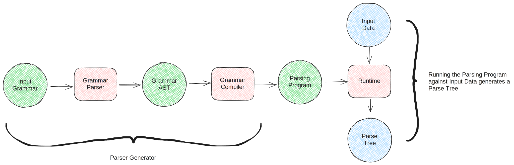
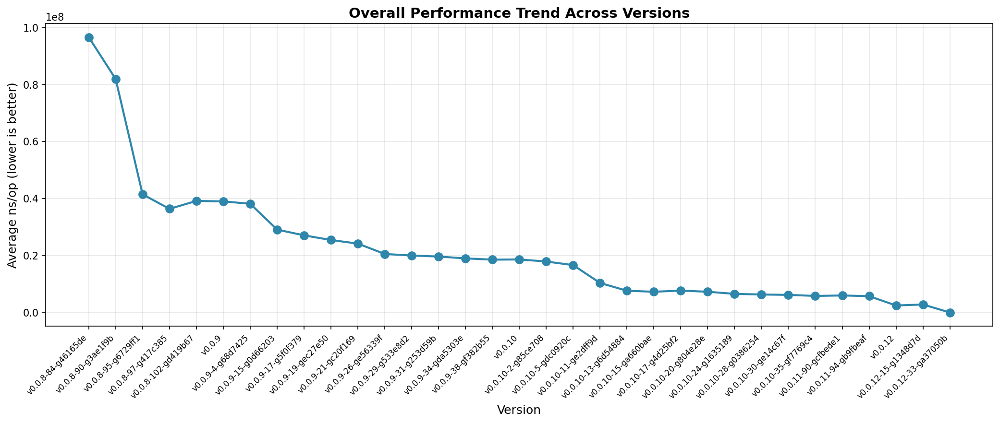

#+TITLE: Project Report 2018-2026
#+AUTHOR: Lincoln Clarete • S'2
#+OPTIONS: toc:nil num:nil reveal_title_slide:nil
#+REVEAL_INIT_OPTIONS: hash: true, history: true
#+REVEAL_ROOT: https://cdn.jsdelivr.net/npm/reveal.js@4.5.0/
#+REVEAL_EXTRA_CSS: extra.css
#+REVEAL_THEME: simple
#+REVEAL_TRANS: linear
#+REVEAL_REVEAL_JS_VERSION: 4

# M-x<ret>load-library<ret>ox-reveal
# C-c C-e R R: to export the presentation

* Parser Generator: Project Report 2018–2026
* Hi 👋 I'm Lincoln

 - brazillian since 1986
 - softwarer since 1998
 - new yorker since 2012
 - recurser since 2018
 - datadog since 2020

* context

** How it started

 - I prototyped a lil parser generator named ~langlang~ during my
   recurse batch

 - it became my pet project, or maybe a bit of an obsession

 - I got stuck a few times which led me to new projects, new rewrites,
   and new lessons

 - I used one of the rewrites of ~langlang~ in one hackathon at work

** How it's going

 - in production at Datadog, parsing hundreds of thousands of metrics
   queries per second

 - part of a query language framework with static analysis, type
   checking and virtual machine interpreter

 - static analysis also validates and repairs input generated by LLMs

 - friends started using it on their projects! There's a circuit
   language coming soon!

* what's a parser
** loose definition

it is a thing that takes raw input and produces structured output

** example

input

#+begin_src text
4 + 3 * 2
#+end_src

Output

#+begin_src text
E
├── E
│   └── "4"
├── "+"
└── E
    ├── E
    │   └── "3"
    ├── "*"
    └── E
        └── "2"
#+end_src

** there are way too many ways to write a parser

 - ~Top-Down (Predictive): Recursive Descent, Combinators, LL(k), Packrat~
 - Bottom-Up (Shift-Reduce): LR(k), Simple LR (SLR), Lookahead LR
   (LALR), CYK (Cocke-Younger-Kasami), GLR (Generalized Left-to-Right)
 - Both: Earley Parser (top-down prediction, bottom-up completion)

** what now

 * before we generate parsers, we might need to know how to write them
   on our own! I didn't, so to practice I wrote [[https://emacs.love/templatel/][templatel]] (and
   [[https://emacs.love/weblorg/][weblorg]].)

 * let me walk you through a top-down recursive descent

* let's roll a quick lil hand written parser
** state

#+begin_src python
  class Parser:
      cursor: int
      source: str
#+end_src

** behavior: literal

#+begin_src python
  def literal(self, e):
      c = self.source[self.cursor]
      if c == e:
          self.cursor += 1
          return c
      raise Error(f"Expected {e}, but got {c}")
#+end_src

** behavior: repetition

#+begin_src python
  def zero_or_more(self, expression):
      output = []
      while True:
          try:
              output.append(expression())
          except:
              break
      return output
#+end_src

** behavior: choice

#+begin_src python
  def choice(self, alternatives):
      cursor = self.cursor
      for alternative in alternatives:
          try:
              return alternative()
          except:
              self.cursor = cursor # backtracking
      raise Error(f"dunno wat to do")
#+end_src

** a small language

#+begin_src python
class SheepLang(Parser):
    def parse(self):
        output = [self.literal("b")]
        output.extend(self.zero_or_more(lambda: self.choice([
            lambda: self.literal("a"),
            lambda: self.literal("e"),
        ])))
        output.append(self.literal("h"))
        return output
#+end_src

** usage

#+begin_src python
>>> SheepLang("baaah").parse()
['b', 'a', 'a', 'a', 'h']
>>> SheepLang("beeeeh").parse()
['b', 'e', 'e', 'e', 'e', 'h']
#+end_src

* just one more handwritten parser
** behavior: any literal

#+begin_src python
  def any_(self):
      if self.cursor < len(self.source):
          c = self.source[self.cursor]
          self.cursor += 1
          return c
      raise Error("EOF")
#+end_src

** behavior: literal range

#+begin_src python
  def literal_range(self, a, b):
      c = self.source[self.cursor]
      if c >= a and c <= b:
          self.cursor += 1
          return c
      raise Error(f"Expected [{a}-{b}], but got {c}")
#+end_src

** behavior: one or more

#+begin_src python
  def one_or_more(self, expression):
      output = [expression()]
      output.extend(self.zero_or_more(expression))
      return output
#+end_src

** behavior: lookahead

#+begin_src python
  def not_(self, expression):
      cursor = self.cursor
      try:
          expression()
      except:
          return
      finally:
          self.cursor = cursor    # doesn't ever consume input
      raise Error("NOT")
#+end_src

** a list language: atoms

#+begin_src python
  def parse_decimal(self):
      return ''.join(self.one_or_more(
          lambda: self.literal_range("0", "9")))

  def parse_string(self):
      output = [self.literal('"')]

      def char():
          self.not_(lambda: self.literal('"'))
          return self.any_()

      output.append(''.join(self.zero_or_more(char)))
      output.append(self.literal('"'))
      return output
#+end_src

** a list language: values & lists

@@html:<table width="100%"><tr><td width="50%">@@

#+begin_src python
  def parse_list(self):
      output = [self.literal("(")]
      self.parse_spaces()

      def item():
          v = self.parse_value()
          self.parse_spaces()
          return v
      
      output.extend(self.zero_or_more(item))
      output.append(self.literal(")"))
      return output
#+end_src

@@html:</td><td>@@

#+begin_src python
  def parse_value(self):
      return self.choice([
          self.parse_decimal,
          self.parse_string,
          self.parse_list,
      ])

  def parse(self):
      return self.parse_value()
#+end_src

@@html:</td></tr></table>@@

** usage

#+begin_src python
  >>> ListLang("()").parse()
  ['(', ')']
  >>> ListLang('"foo"').parse()
  ['"', 'foo', '"']
  >>> ListLang('(42)').parse()
  ['(', ['42'], ')']
  >>> ListLang('(42 "a str")').parse()
  ['(', ['42'], ['"', 'a str', '"'], ')']
  >>> ListLang('(41 42 (43 44 (45 46)))').parse()
  ['(', '41', '42', ['(', '43', '44', ['(', '45', '46', ')'], ')'], ')']
#+end_src

** not bad, but

 * the API is so concise that generating it from a high level
   description shouldn't be too hard

 * and would give us a clear spec that could be shared between
   implementations in different host languages

* parsing expression grammars
** sheep

#+begin_src peg
  SheepLang <- 'b' ('a' / 'e')* 'h'
#+end_src

** list

#+begin_src peg
  Value    <- Decimal / String / List
  Decimal  <- [0-9]+
  String   <- '"' (!'"' .)* '"'
  List     <- '(' (!')' Value)* ')'
#+end_src

** json

#+begin_src peg
JSON   <- Value !.
Value  <- Object / Array / String / Number / 'true' / 'false' / 'null'
Array  <- '[' (Value (',' Value)*)? ']'
Object <- '{' (Member (',' Member)*)? '}'
Member <- String ':' Value
Number <- '-'? [0-9]+
String <- '"' (!'"' .)* '"'
#+end_src

** semantics

 * Formalism for describing recursive top-down parsers
 * Borrow productions from Context Free Grammars
 * Expression operators borrowed from /regexes/
 * Infinite lookahead via predicates
 * Unsuitable for handling ambiguity, but can describe all
   deterministic context-free languages

** expressions

    |------------------+-----------+------------------------|
    | *sequence*       | =e1 e2=   |                        |
    | *ordered choice* | =e1 / e2= |                        |
    | *not predicate*  | =!e=      |                        |
    | *and predicate*  | =&e=      | (sugar for =!!e=)      |
    | *zero or more*   | =e*=      |                        |
    | *one or more*    | =e+=      | (sugar for =ee*=)      |
    | *optional*       | =e?=      | (sugar for =&ee / !e=) |

** what I like about them

 - less time thinking of "what language" fits the tool, so long
   they're unambiguous
 - having lexer and parser melted together is simpler
 - easy to reason about deterministic choice operator "longest match
   first"

* generating parsers
** overview

** yep, another handwritten parser!
#+begin_src python
  class PEG(Parser):
      def parse_grammar(self):
          defs = self.one_or_more(self.parse_definition)
          return ['Grammar', defs]
      def parse_definition(self):
          ident = self.parse_identifier()
          self.parse_spaces()
          self.literal("<")
          self.literal("-")
          self.parse_spaces()
          expr = self.parse_expr()
          return ['Def', [ident, expr]]
      # ...
#+end_src

** parse grammar

#+begin_src peg
  Sheep <- 'b' ('a' / 'e')* 'h'
#+end_src

@@html:
@@

#+begin_src text
Grammar (1:1..2:1)
└── Definition[Sheep] (1:1..2:1)
    └── Sequence (1:10..2:1)
        ├── Literal[b] (11..12)
        ├── ZeroOrMore (14..26)
        │   └── Choice (15..24)
        │       ├── Sequence (15..19)
        │       │   └── Literal[a] (16..17)
        │       └── Sequence (21..24)
        │           └── Literal[e] (22..23)
        └── Literal[h] (28..29)
#+end_src

** what now? emit code off the AST?

#+begin_src python
  def visit_definition(self, definition):
      ident, expr = definition
      self.output.write(f"def parse_{ident}(self):")
      self.output.ident()
      self.visit_expr(expr)
      self.output.unident()
  # ...
  def visit_literal(self, literal):
      self.output.write(f"self.literal('{escape(literal)}')")
#+end_src

** many ways of implementing it

 * a parser combinator library (no need to parse input grammar)
 * a packrat parser (e.g.: tree interpreter with memoization)
 * [[https://dl.acm.org/doi/10.1145/1408681.1408683][a parsing machine for PEGs]] <-- this is what I picked! :)

** virtual machine
*** state

#+begin_src python
  class Frame:
      t: 'Backtracking' | 'Call'
      pc: int
      cursor: int

  type Instruction = Halt | Char | Choice | Commit | ...

  class VirtualMachine:
      source: str = ""
      cursor: int = 0
      code: list[Instruction] = []
      pc: int = 0
      stack: list[Frame] = [] # stack frame
#+end_src

*** behavior: vm loop

#+begin_src python
  def run(self):
      while True:
          instruction = self.code[self.pc]
          match instruction:
              case Halt():
                  break
              # ...
#+end_src

*** Instruction Semantics

Char X
#+begin_src python
  〈pc,cursor,stack〉-> Char X ->〈pc+1, cursor+1, stack〉
   # when source[cursor] == X
  〈pc,cursor,stack〉-> Char X -> Fail〈e〉
   # when source[cursor] != X
#+end_src

Choice L
#+begin_src python
〈pc,cursor,stack〉 -> Choice l ->〈pc+1,cursor, (pc+l,cursor) : stack〉
#+end_src

Commit L
#+begin_src python
  〈pc,cursor,head : stack〉-> Commit l ->〈pc + l, cursor, stack〉
#+end_src

*** Instruction Behavior

#+begin_src python
  case Char(ch=ch):
      current = self.source[self.cursor]
      if current == ch:
          self.cursor += 1
          self.pc += 1
          continue
      self.fail()
  case Choice(label=label):
      frame = Frame(t=FrameType.BACKTRACKING, pc=label, cursor=self.cursor)
      self.stack.append(frame)
      self.pc += 1
  case Commit(label=label):
      self.stack.pop()
      self.pc = label
#+end_src

*** Fail state

#+begin_src python
  def fail(self):
      while len(self.stack) > 0:
          frame = self.stack.pop()
          if frame.t == FrameType.BACKTRACKING:
              self.pc = frame.pc
              self.cursor = frame.cursor
              return
      raise Exception("Error!")
#+end_src

*** semantics: repetition
#+begin_src python
p∗ ≡ Choice |p| + 2
     p
     Commit − (|p| + 1)
#+end_src
*** semantics: choice

#+begin_src python
p1/p2 ≡ Choice |p1| + 2
        p1
        Commit |p2| + 1
        p2
#+end_src
*** sheep program
#+begin_src python
SheepProgram = [
    Char("b"),  # 00
    Choice(7),  # 01 -------------+
    Choice(5),  # 02 -+           |
    Char("a"),  # 03  |           |
    Commit(6),  # 04  |           |
    Char("e"),  # 05 -+- choice   |
    Commit(1),  # 06 -+-----------+- repetition
    Char("h"),  # 07
    Halt(),     # 08
]
#+end_src

** bootstrap grammar parser

 * Now that we have a bytecode compiler, can't we point it at
   ~langlang.peg~?

* performance
** journey so far

** what made the biggest impact

| version | optimizations                                                            | impact      |
|---------+--------------------------------------------------------------------------+-------------|
| v0.0.8  | tree-walking interpreter                                                 | baseline    |
| v0.0.9  | bytecode VM + charset Set/Span                                           | ~50x        |
| v0.0.9  | inlining, hoist vars, drop Input interface                               | ~2x on top  |
| v0.0.11 | cap frames arena, SoA tree, pre-compile labels, bitset in recovery check | 0 allocs/op |

** benchmark a 500KB JSON file on Apple M1 Max
*** throughput

| parser                   | MiB/s | vs stdlib |
|--------------------------+-------+-----------|
| buger-skim ¹             | 479.0 |     4.36× |
| langlang-stripped-nocap  | 289.0 |     2.63× |
| buger-jsonparser ²       | 231.6 |     2.11× |
| pointlander-stripped     | 193.1 |     1.76× |
| langlang-stripped        | 173.7 |     1.58× |
| pointlander              | 112.2 |     1.02× |
| *encoding/json (stdlib)* | 109.8 |     1.00× |
| langlang-nocap           |  66.9 |     0.61× |
| langlang                 |  34.5 |     0.31× |
| antlr                    |  19.3 |     0.18× |
| treesitter               |  14.6 |     0.13× |
| pigeon                   |   2.6 |     0.02× |

*** allocations

| parser                  | allocs/op |      B/op |
|-------------------------+-----------+-----------|
| buger-skim              |         0 |         0 |
| langlang-nocap          |         0 |         0 |
| langlang-stripped-nocap |         0 |         0 |
| langlang-stripped       |         0 |    83 KiB |
| langlang                |         0 |   2.0 MiB |
| treesitter              |         6 |   760 KiB |
| buger-jsonparser        |    34,117 |   541 KiB |
| pointlander-stripped    |        46 |  13.7 MiB |
| pointlander             |        52 |  37.0 MiB |
| encoding/json           |    75,750 |   3.5 MiB |
| antlr                   |   337,483 |  32.0 MiB |
| pigeon                  | 4,421,017 |  155.0 MiB |

* highly interesting PEG extensions
** error reporting

@@html:<table width="100%"><tr><td width="1vw">@@
Grammar with labels
@@html:</td><td>@@
Text Input
@@html:</td></tr><tr><td>@@

#+begin_src peg
Program <- Assign+ EOF
Assign  <- Name '='^eq Expr^value ';'^semi
Name    <- [a-z]+
Expr    <- [0-9]+ / [a-z]+
#+end_src

@@html:</td><td>@@

#+begin_src text
x = 1;
y = ;
z = 3;
#+end_src

@@html:</td></tr></table>@@

@@html:<table width="100%"><tr><th>@@
Output
@@html:</th></tr><tr><td>@@

#+begin_src text
[value] Expected '0-9', 'a-z' but got ';' @ 12
#+end_src

@@html:</td></tr></table>@@

** error recovery

#+begin_src peg
// recovery expressions
eq    <- (![0-9a-z] .)*
value <- (!';' .)*
semi  <-
#+end_src

@@html:
@@

#+begin_src text
  ...
  ├── Assign (2:1..2:6)
  │   └── Sequence<4> (2:1..2:6)
  │       ├── Name (2:1..2:2)
  │       │   └── "y" (2:1..2:2)
  │       ├── "=" (2:3..2:4)
  │       ├── Error<value> (2:5) <- error label captured
  │       └── ";" (2:5..2:6)
  ...
#+end_src

** left recursion

@@html:<table width="100%"><tr><td width="1vw">@@

#+begin_src peg
E <- E '+' E
   / E '*' E
   / [0-9]+
#+end_src

@@html:</td><td>@@

#+begin_src peg
E <- E¹ '+' E¹
   / E² '*' E²
   / [0-9]+
#+end_src

@@html:</td></tr><tr><td>@@

#+begin_src text
E (1..10)
└── Sequence<3> (1..10)
    ├── E (1..2)
    │   └── "2" (1..2)
    ├── "*" (3..4)
    └── E (5..10)
        └── Sequence<3> (5..10)
            ├── E (5..6)
            │   └── "3" (5..6)
            ├── "+" (7..8)
            └── E (9..10)
                └── "4" (9..10)
#+end_src

@@html:</td><td>@@

#+begin_src text
E (1..10)
└── Sequence<3> (1..10)
    ├── E (1..6)
    │   └── Sequence<3> (1..6)
    │       ├── E (1..2)
    │       │   └── "2" (1..2)
    │       ├── "*" (3..4)
    │       └── E (5..6)
    │           └── "3" (5..6)
    ├── "+" (7..8)
    └── E (9..10)
        └── "4" (9..10)
#+end_src

@@html:</td></tr></table>@@

* work ahead

 * [perf] head-fail optimization
 * [perf] safe left-factoring
 * [perf] SIMD for some subtrees of grammars
 * [perf] code generator targeting host languages
 * [devx] step debugger
 * [feat] more target languages
 * [feat] support for space-based indentation
 * [feat] first class support for text matching
 * [feat] incremental parsing
 * [feat] match data structures
 * [feat] rewrite rules
* closing thoughts

 * It's been an immensely fun challenge to understand how programming
   languages work

 * Chose this PEG VM project because I wanted to learn more about
   programming languages but didn't want to get stuck in parsing!

 * Recursive side projects are an interesting way to keep the
   excitement going throughout the years

 * PEGs are new(2004) and there are quite a few brilliant minds
   putting real thought into them

* that's all folks

** https://clarete.li/langlang

Try it yourself

** lincoln@clarete.li

Thank you and let's chat :)

